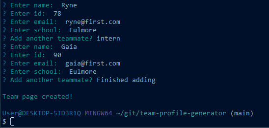
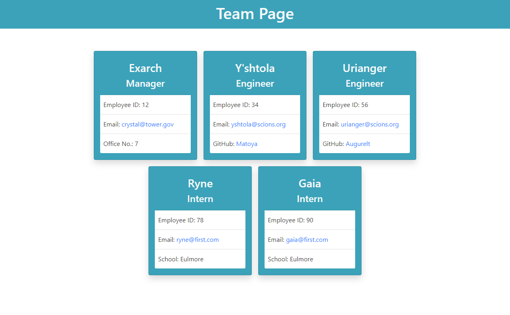

# Team Profile Generator

This is a team profile page generator for developer or similar industry teams consisting of a manager, engineers, and/or interns. It utilizes [Inquirer.js](https://www.npmjs.com/package/inquirer) for a series of prompts that allow input of employee info.

Once the user is finished adding to the team, an `index.html` file is created, displaying each employee's info on a card.

### Optional Sections

Any queries left blank will be omitted from the generated employee cards.

### Video Demo

See video demonstration [here](https://drive.google.com/file/d/1Fl8bUa2DnGrOZGK57duejcwkFQkvFrZh/view?usp=sharing).

---

## Getting Started

These instructions will get you a copy of the project up and running on your local machine for development and testing purposes. 

### Prerequisites

* IDE to view/edit source code (e.g. Visual Studio Code).
* [Node.js](https://nodejs.org/en/)

### Installing

1. Clone repository.
1. Navigate to `team-profile-generator` directory in terminal.
1. `npm install` dependencies.
1. Run `node index.js`.

### Testing

The `test` directory contains unit tests that can be run using Jest.js with the command `npm test`.

---

## Built With

* [Node.js](https://nodejs.org/en/)
* [Inquirer.js](https://www.npmjs.com/package/inquirer)
* [Jest.js](https://jestjs.io/)

## Author

Vince Lee
- [Portfolio](https://starryblue7.github.io/portfolio-ii/)
- [Github](https://github.com/StarryBlue7)
- [LinkedIn](https://www.linkedin.com/in/vince-lee/)

## License

License: [MIT License](https://vince-lee.mit-license.org/)